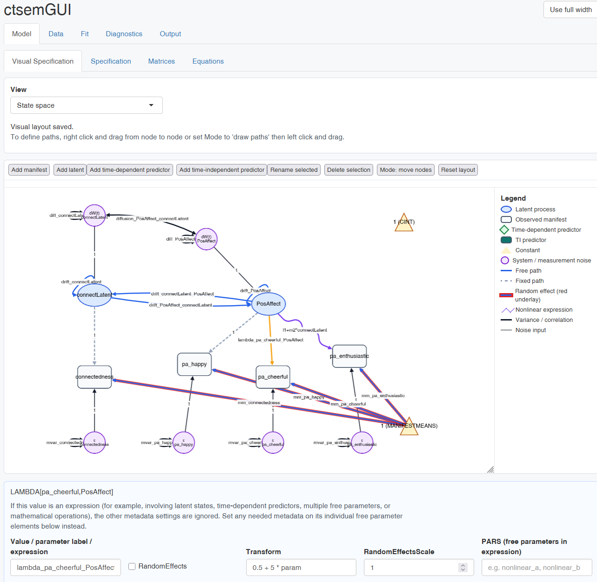

# ctsemGUI

`ctsemGUI` provides a Shiny graphical interface for building, fitting, and
checking `ctsem` models.



The GUI is intended for users who want to work through a model in visible steps:
load or generate data, specify variables, edit model matrices, fit the model,
inspect output, and run common diagnostics.

## Installation

Install from GitHub in R:

```r
install.packages("remotes")
remotes::install_github("cdriveraus/ctsemgui",dependencies=TRUE)
```

`ctsemGUI` uses `ctsem` for model fitting, data generation, equations, and
diagnostics. If `ctsem` is not already installed, install it as well:

```r
install.packages("ctsem",dependencies=TRUE)
```

## Start The GUI

```r
library(ctsemGUI)
ctgui_launch_app()
```

This starts a local Shiny app in your R session.

`ctgui_launch_app()` is the package's supported public API. Model-building,
matrix-editing, validation, and conversion helpers are implementation details
used by the app rather than functions intended for external scripts.

## Open A Model You Already Have

If a model was specified in a script, pass it straight to the launcher instead
of rebuilding it in the interface. The app opens on the visual specification
editor with that model loaded:

```r
model <- ctsem::ctModel(
  type = "ct", n.latent = 2, n.manifest = 2,
  latentNames = c("eta1", "eta2"), manifestNames = c("Y1", "Y2"),
  LAMBDA = diag(2),
  DRIFT = matrix(c("drift11", 0, "drift21", "drift22"), 2, 2, byrow = TRUE)
)

ctgui_launch_app(model, data = mydata)
```

A fitted model can be opened the same way, which also makes the diagnostics and
output tabs available without refitting. When only a fit is given, the model it
was fitted with is the model that opens:

```r
ctgui_launch_app(fit = myfit)
```

`model`, `data`, and `fit` each also accept a path to an `.rds` file (and `data`
accepts a `.csv`), so work saved from a previous session can be reopened
directly. The same objects can still be loaded from inside the app through
**Model > Specification > Model files** and the **Data** tab.

Matrices, parameter labels, transforms, random effects, and TI-predictor
moderation are carried into the GUI, so the opened model estimates what the
scripted one did. `ctModel()` settings that the GUI does not itself edit, such
as `tipredeffectscale` or the raw population standard deviation controls, are
not part of the GUI specification and revert to their ctsem defaults if the
model is rebuilt from the interface.

## What The GUI Does

The app is organised around the usual `ctsem` workflow:

- **Data**: import an existing long-format data frame, import a CSV, or generate
  preview data from the current model.
- **Model**: specify manifest variables, latent processes, ID and time columns,
  predictors, time type, manifest variable types, and editable ctsem matrices.
- **Equations and visuals**: inspect model equations and graph-style summaries of
  temporal dynamics, system noise, measurement links, and generated trajectories.
- **Fit**: run `ctFit()` with a small set of common options and view fit logs,
  warnings, and fit-equation output.
- **Diagnostics**: run prediction plots, residual ACF checks, posterior
  predictive checks, lagged covariance checks, dynamics plots, and TI-predictor
  effect plots.
- **Output**: view `summary(fit)`, `ctSummaryMatrices(fit)`, parameter tables,
  fit comparisons, and generated R code.

## Data Format

The GUI assumes long-format data: one row per observation occasion, with columns
for subject ID, time, observed variables, and any predictors.

